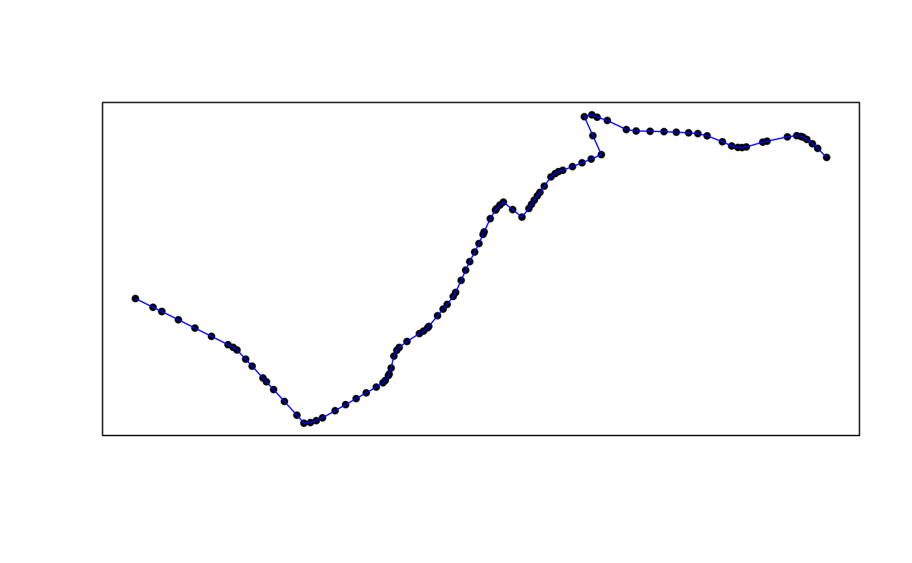

# gtfs2gps: Converting GTFS data to GPS-like format

Abstract

Package `gtfs2gps` has a set of functions to convert public transport
GTFS data to GPS-like format using `data.table`. It also has some
functions to convert both representations to simple feature format.

## Introduction

Package `gtfs2gps` allows users to convert public transport GTFS data
into a single `data.table` format with GPS-like records, which can then
be used in various applications such as running transport simulations or
scenario analyses. Before using the package, just install it from
GitHub.

``` r
install.packages("gtfs2gps")
```

## Loading data

After loading the package, GTFS data can be read into R by using
[`read_gtfs()`](https://ipeagit.github.io/gtfs2gps/reference/read_gtfs.md).
This function gets a zipped GTFS file and returns a list of `data.table`
objects. The returning list contains the data of each GTFS file indexed
according to their file names without extension.

``` r
library("gtfs2gps")
#> gtfs2gps version 2.1-4 is now loaded
poa <- read_gtfs(system.file("extdata/poa.zip", package ="gtfs2gps"))
#> Unzipped the following files to /tmp/RtmpRVtxxm/gtfsio:
#>   * agency.txt
#>   * calendar.txt
#>   * routes.txt
#>   * shapes.txt
#>   * stop_times.txt
#>   * stops.txt
#>   * trips.txt
#> Reading agency
#> Reading calendar
#> Reading routes
#> Reading shapes
#> Reading stop_times
#> Reading stops
#> Reading trips
names(poa)
#> [1] "agency"     "calendar"   "routes"     "shapes"     "stop_times"
#> [6] "stops"      "trips"
head(poa$trips)
#>    route_id service_id    trip_id shape_id
#>      <char>     <char>     <char>   <char>
#> 1:       T2       T2@1 T2-1@1#520     T2-1
#> 2:       T2       T2@1 T2-1@1#540     T2-1
#> 3:       T2       T2@1 T2-1@1#555     T2-1
#> 4:       T2       T2@1 T2-1@1#610     T2-1
#> 5:       T2       T2@1 T2-1@1#620     T2-1
#> 6:       T2       T2@1 T2-1@1#628     T2-1
```

Note that not all GTFS files are loaded into R. This function only loads
the necessary data to spatially and temporally handle trips and stops,
which are: “shapes.txt”, “stop_times.txt”, “stops.txt”, “trips.txt”,
“agency.txt”, “calendar.txt”, “routes.txt”, and “frequencies.txt”, with
this last four being optional. If a given GTFS zipped file does not
contain all of these required files then
[`read_gtfs()`](https://ipeagit.github.io/gtfs2gps/reference/read_gtfs.md)
will stop with an error.

In the code below we filter only the shape ids \`c(“T2-1”, “A141-1”) to
allow faster execution the next scripts.

``` r
object.size(poa) |> format(units = "Kb")
#> [1] "1145.7 Kb"
poa_small <- gtfstools::filter_by_shape_id(poa, c("T2-1", "A141-1"))
object.size(poa_small) |> format(units = "Kb")
#> [1] "559.5 Kb"
```

We can then easily convert the data to simple feature format and plot
them.

``` r
poa_small_shapes_sf <- gtfs2gps::gtfs_shapes_as_sf(poa_small)
poa_small_stops_sf <- gtfs2gps::gtfs_stops_as_sf(poa_small)
plot(sf::st_geometry(poa_small_shapes_sf))
plot(sf::st_geometry(poa_small_stops_sf), pch = 20, col = "red", add = TRUE)
box()
```


After subsetting the data, it is also possible to save it as a new GTFS
file using
[`write_gtfs()`](https://ipeagit.github.io/gtfs2gps/reference/write_gtfs.md),
as shown below.

``` r
temp_gtfs <- tempfile(pattern = 'poa_small', fileext = '.zip')

gtfs2gps::write_gtfs(poa_small, temp_gtfs)
```

## Converting to GPS-like format

To convert GTFS to GPS-like format, use
[`gtfs2gps()`](https://ipeagit.github.io/gtfs2gps/reference/gtfs2gps.md).
This is the core function of the package. It takes a GTFS zipped file as
an input and returns a `data.table` where each row represents a
‘GPS-like’ data point for every trip in the GTFS file. In summary, this
function interpolates the space-time position of each vehicle in each
trip considering the network distance and average speed between stops.
The function samples the timestamp of each vehicle every $15m$ by
default, but the user can set a different value in the
`spatial_resolution` argument. See the example below.

``` r
poa_gps <- gtfs2gps(temp_gtfs, spatial_resolution = 100)
#> Warning: UNRELIABLE VALUE: Future (<unnamed-1>) unexpectedly generated random
#> numbers without specifying argument 'seed'. There is a risk that those random
#> numbers are not statistically sound and the overall results might be invalid.
#> To fix this, specify 'seed=TRUE'. This ensures that proper, parallel-safe
#> random numbers are produced. To disable this check, use 'seed=NULL', or set
#> option 'future.rng.onMisuse' to "ignore". [future <unnamed-1>
#> (0bfda05fb08168d33f4ac1d72ba6dd54-1); on
#> 0bfda05fb08168d33f4ac1d72ba6dd54@runnervmd7ynf<8288>]
#> Warning: UNRELIABLE VALUE: Future (<unnamed-2>) unexpectedly generated random
#> numbers without specifying argument 'seed'. There is a risk that those random
#> numbers are not statistically sound and the overall results might be invalid.
#> To fix this, specify 'seed=TRUE'. This ensures that proper, parallel-safe
#> random numbers are produced. To disable this check, use 'seed=NULL', or set
#> option 'future.rng.onMisuse' to "ignore". [future <unnamed-2>
#> (0bfda05fb08168d33f4ac1d72ba6dd54-2); on
#> 0bfda05fb08168d33f4ac1d72ba6dd54@runnervmd7ynf<8288>]
head(poa_gps)
#>    shape_id     trip_id route_type    id timestamp shape_pt_lon shape_pt_lat
#>      <char>      <char>      <int> <int>   <ITime>        <num>        <num>
#> 1:   A141-1 A141-1@1#30          3     1      <NA>    -51.14692    -30.14979
#> 2:   A141-1 A141-1@1#30          3     2      <NA>    -51.14610    -30.15014
#> 3:   A141-1 A141-1@1#30          3     3  00:30:00    -51.14570    -30.15031
#> 4:   A141-1 A141-1@1#30          3     4  00:30:00    -51.14570    -30.15031
#> 5:   A141-1 A141-1@1#30          3     5  00:30:29    -51.14493    -30.15064
#> 6:   A141-1 A141-1@1#30          3     6  00:30:58    -51.14417    -30.15097
#>    stop_id stop_sequence               speed         dist       cumdist
#>     <char>         <int>             <units>      <units>       <units>
#> 1:    <NA>            NA 1.000000e-12 [km/h]  0.00000 [m]   0.00000 [m]
#> 2:    <NA>            NA           NA [km/h] 87.23608 [m]  87.23608 [m]
#> 3:     434             1           NA [km/h] 43.32548 [m] 130.56155 [m]
#> 4:     434             1 1.000000e-12 [km/h]  0.00000 [m] 130.56155 [m]
#> 5:    <NA>            NA 1.013763e+01 [km/h] 82.11437 [m] 212.67592 [m]
#> 6:    <NA>            NA 1.013763e+01 [km/h] 82.11437 [m] 294.79029 [m]
#>         cumtime trip_number
#>         <units>       <int>
#> 1:  0.00000 [s]           1
#> 2:       NA [s]           1
#> 3:       NA [s]           1
#> 4:  0.00000 [s]           1
#> 5: 29.15983 [s]           1
#> 6: 58.31967 [s]           1
```

The following figure maps the first 100 data points of the sample data
we processed. They can be converted to `simple feature` points or
linestring.

``` r
poa_gps60 <- poa_gps[1:100, ]

# points
poa_gps60_sfpoints <- gps_as_sfpoints(poa_gps60)

# linestring
poa_gps60_sflinestring <- gps_as_sflinestring(poa_gps60)

# plot
plot(sf::st_geometry(poa_gps60_sfpoints), pch = 20)
plot(sf::st_geometry(poa_gps60_sflinestring), col = "blue", add = TRUE)
box()
```



The function
[`gtfs2gps()`](https://ipeagit.github.io/gtfs2gps/reference/gtfs2gps.md)
automatically recognizes whether the GTFS data brings detailed
`stop_times.txt` information or whether it is a `frequency.txt` GTFS
file. A sample data of a GTFS with detailed `stop_times.txt` cab be
found below:

``` r
poa <- system.file("extdata/poa.zip", package ="gtfs2gps")

poa_gps <- gtfs2gps(poa, spatial_resolution = 50)
#> Warning: UNRELIABLE VALUE: Future (<unnamed-3>) unexpectedly generated random
#> numbers without specifying argument 'seed'. There is a risk that those random
#> numbers are not statistically sound and the overall results might be invalid.
#> To fix this, specify 'seed=TRUE'. This ensures that proper, parallel-safe
#> random numbers are produced. To disable this check, use 'seed=NULL', or set
#> option 'future.rng.onMisuse' to "ignore". [future <unnamed-3>
#> (0bfda05fb08168d33f4ac1d72ba6dd54-3); on
#> 0bfda05fb08168d33f4ac1d72ba6dd54@runnervmd7ynf<8288>]
#> Warning: UNRELIABLE VALUE: Future (<unnamed-4>) unexpectedly generated random
#> numbers without specifying argument 'seed'. There is a risk that those random
#> numbers are not statistically sound and the overall results might be invalid.
#> To fix this, specify 'seed=TRUE'. This ensures that proper, parallel-safe
#> random numbers are produced. To disable this check, use 'seed=NULL', or set
#> option 'future.rng.onMisuse' to "ignore". [future <unnamed-4>
#> (0bfda05fb08168d33f4ac1d72ba6dd54-4); on
#> 0bfda05fb08168d33f4ac1d72ba6dd54@runnervmd7ynf<8288>]
#> Warning: UNRELIABLE VALUE: Future (<unnamed-5>) unexpectedly generated random
#> numbers without specifying argument 'seed'. There is a risk that those random
#> numbers are not statistically sound and the overall results might be invalid.
#> To fix this, specify 'seed=TRUE'. This ensures that proper, parallel-safe
#> random numbers are produced. To disable this check, use 'seed=NULL', or set
#> option 'future.rng.onMisuse' to "ignore". [future <unnamed-5>
#> (0bfda05fb08168d33f4ac1d72ba6dd54-5); on
#> 0bfda05fb08168d33f4ac1d72ba6dd54@runnervmd7ynf<8288>]

poa_gps_sflinestrig <- gps_as_sfpoints(poa_gps)

plot(sf::st_geometry(poa_gps_sflinestrig[1:200,]))

box()
```


## Methodological note

For a given trip, the function `gtfs2gps` calculates the average speed
between each pair of consecutive stops given by the ratio between
cumulative network distance `S` and departure time `t` for a consecutive
pair of valid stop_ids (`i`),


Since the beginning of each trip usually starts before the first
stop_id, the mean speed cannot be calculated as shown in the previous
equation because information on `i` period does not exist. In this case,
the function consider the mean speed for the whole trip. It also happens
after the last valid stop_id (`N`) of the trips, where info on `i + 1`
also does not exist.


## Final remarks

If you have any suggestions or want to report an error, please visit the
GitHub page of the package [here](https://github.com/ipeaGIT/gtfs2gps).
